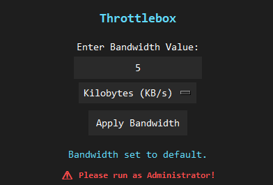
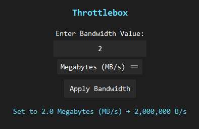

# Throttlebox

Throttlebox allows you to conveniently limit the bandwidth of incoming connections to your machine. It does this by intercepting all the network traffic on your device, and then releasing them at a controlled rate using pydivert (https://github.com/ffalcinelli/pydivert). 

The intention is to use this tool to test features that require a limited internet connection.

**Note this tool only works on Windows devices. For Apple, XTools has a built-in limiter.**

## Requirements
- Python 3.4+
- Windows Vista/7/8/10 or Windows Server 2008 (32 or 64 bit)
- Administrator Privileges

## Installation
To build from source, clone the repository and in the root, run
```python
pip install -r requirements.txt
```

## Usage
You must run the application as an administrator, else you will see a warning and the tool will not work.



You can select a value, and the unit. Click 'Apply Bandwidth' to immediately start limiting traffic on your whole machine.

